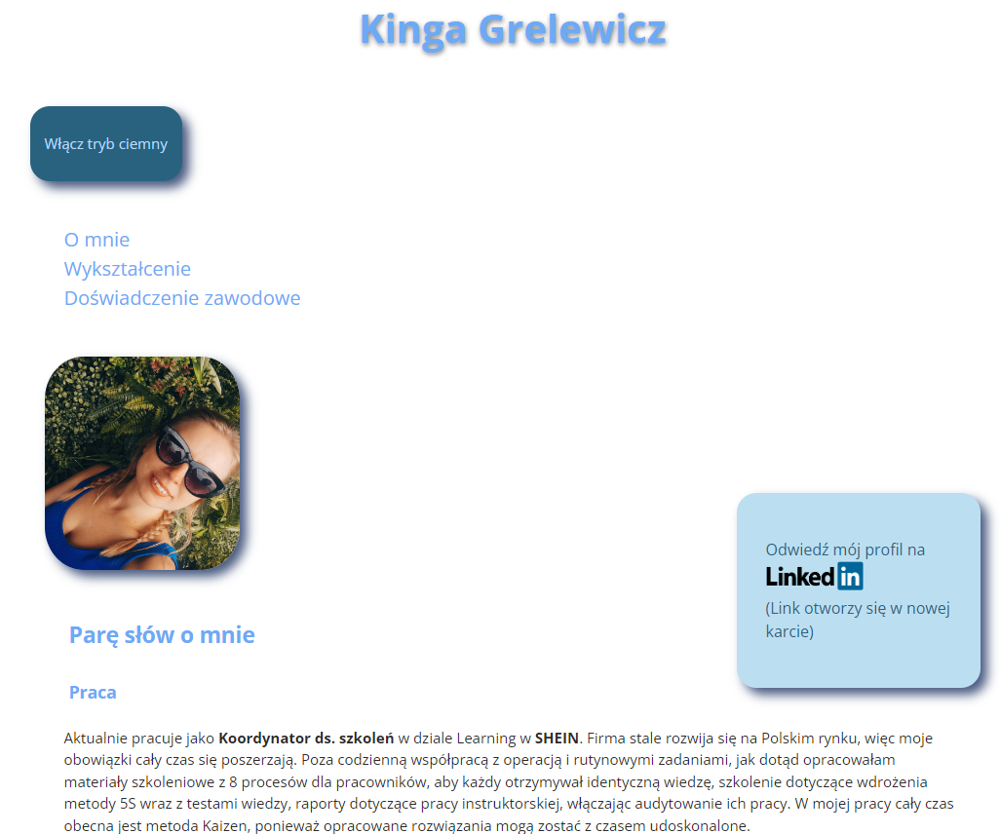

# Kinga Grelewicz - website about me

## Description
Hi, my name is Kinga, take a look at my first website.
This is my personal website contains information about my work experience, my hobby and schools. I will share my my projects here.
Visitors can browse my portfolio to see examples of my work and learn more about me and my background. The website also includes a contact channels where visitors can reach out to me directly.

## Demo
My homepage is now live on GitHub Pages. Check it out here:
https://kingagrelewicz.github.io/homepage/
 

## Technology
During creating the website I was using Visual Studio Code and I used a BEM convention, ES6+ Features.
The website is built using HTML, CSS, and JavaScript. The website was created to response correctly on desktop, tablets, and mobile devices. 
I used fonts available on Google Fonts, Sharing debugger
